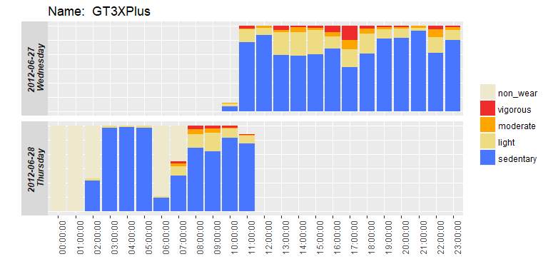

[](http://www.repostatus.org/#active) [](https://travis-ci.org/TheTS/actigraphr) [](/commits/master) [](https://codecov.io/gh/TheTS/actigraphr)

<!-- README.md is generated from README.Rmd. Please edit that file -->
### actigraphr: Non-wear, sleep, and physical activity analysis from ActiGraph data

The `actigraphr` package is used to analyse accelerometer data obtaiend from ActiGraph devices. It includes several non-wear, sleep, and physical activity detection algorithms.

This package extends the [`actigraph.sleepr`](https://github.com/dipetkov/actigraph.sleepr) package, written by Desislava Petkova.

Non-wear detection algorithms:

-   Troiano (Troiano et al. 2008)
-   Choi (Choi et al. 2011)

Sleep scoring algorithms:

-   Sadeh (Sadeh, Sharkey, and Carskadon 1994)
-   Cole-Kripke (Cole et al. 1992)
-   Tudor-Locke (Tudor-Locke et al. 2014)

Physical activity thresholds:

-   Freedson adult (Freedson, Melanson, and Sirard 1998)
-   Freedson adult VM (Sasaki, John, and Freedson 2011)
-   Freedson children (Freedson, David, and Janz 2005)
-   Evenson children (Evenson et al. 2008)
-   Mattocks children (Mattocks et al. 2007)
-   Puyau children (Puyau et al. 2007)

### Installation

``` r
library("devtools")
install_github("TheTS/actigraphr")
```

### Examples

`actigraphr` supports reading AGD files and raw gt3x files that are exported from the Actilife software.

``` r
library(actigraphr)

agd_file <- system.file("extdata", "GT3XPlus-RawData-Day01.agd",
                        package = "actigraphr")

agdb <- read_agd(agd_file)
```

When an AGD file is read, the information about the device settings are saved as attributes:

``` r
str(agdb)
#> Classes 'tbl_agd', 'tbl_df', 'tbl' and 'data.frame': 8999 obs. of  10 variables:
#>  $ timestamp      : POSIXct, format: "2012-06-27 10:54:00" "2012-06-27 10:54:10" ...
#>  $ axis1          : int  377 465 505 73 45 0 0 207 0 0 ...
#>  $ axis2          : int  397 816 444 91 43 0 0 218 0 0 ...
#>  $ axis3          : int  413 1225 713 106 115 0 0 270 0 0 ...
#>  $ steps          : int  2 4 6 1 0 0 0 1 0 0 ...
#>  $ lux            : int  0 0 0 0 0 0 0 0 0 0 ...
#>  $ inclineoff     : int  0 0 0 0 0 0 0 0 0 0 ...
#>  $ inclinestanding: int  10 10 10 10 0 0 0 10 0 0 ...
#>  $ inclinesitting : int  0 0 0 0 10 10 10 0 10 10 ...
#>  $ inclinelying   : int  0 0 0 0 0 0 0 0 0 0 ...
#>  - attr(*, "age")= chr "43"
#>  - attr(*, "batteryvoltage")= chr "4.22"
#>  - attr(*, "culturename")= chr "English (United States)"
#>  - attr(*, "dateOfBirth")= POSIXct, format: "1969-04-17"
#>  - attr(*, "datetimeformat")= chr "M/d/yyyy"
#>  - attr(*, "decimal")= chr "."
#>  - attr(*, "devicename")= chr "GT3XPlus"
#>  - attr(*, "deviceserial")= chr "NEO1DXXXXXXXX"
#>  - attr(*, "deviceversion")= chr "2.5.0"
#>  - attr(*, "dominance")= chr "Non-Dominant"
#>  - attr(*, "downloaddatetime")= POSIXct, format: "2012-06-28 16:25:52"
#>  - attr(*, "epochcount")= int 8999
#>  - attr(*, "epochlength")= int 10
#>  - attr(*, "filter")= chr "Normal"
#>  - attr(*, "finished")= chr "true"
#>  - attr(*, "grouping")= chr ","
#>  - attr(*, "height")= chr "172.72"
#>  - attr(*, "limb")= chr "Ankle"
#>  - attr(*, "machinename")= chr "DESKTOP-51642G4"
#>  - attr(*, "mass")= chr "69.8532249799612"
#>  - attr(*, "modenumber")= chr "61"
#>  - attr(*, "original sample rate")= chr "30"
#>  - attr(*, "osversion")= chr "Microsoft Windows NT 10.0.14393.0"
#>  - attr(*, "proximityIntervalInSeconds")= chr "0"
#>  - attr(*, "race")= chr "White / Caucasian"
#>  - attr(*, "sex")= chr "Male"
#>  - attr(*, "side")= chr "Left"
#>  - attr(*, "softwarename")= chr "ActiLife"
#>  - attr(*, "softwareversion")= chr "6.13.3"
#>  - attr(*, "startdatetime")= POSIXct, format: "2012-06-27 10:54:00"
#>  - attr(*, "stopdatetime")= POSIXct, format: "2012-06-28 11:53:58"
#>  - attr(*, "subjectname")= chr "GT3XPlus"
#>  - attr(*, "unexpectedResets")= chr "0"
```

This file can then be processed using the dplyr pipe syntax. This snippet collapses the data to 30 second epochs, before adding weartime and physical activity intensity columns:

``` r
scored <- agdb %>% 
  collapse_epochs(60) %>% 
  apply_weartime(fun = apply_troiano) %>% 
  apply_cutpoints(cutpoints = "evenson_children") 
```

``` r
head(scored, 5)
#>             timestamp axis1 axis2 axis3 steps inclineoff inclinestanding inclinesitting inclinelying wear activity
#> 1 2012-06-27 10:54:00  1465  1791  2572    13          0              40             20            0    1        2
#> 2 2012-06-27 10:55:00   207   218   270     1          0              10             50            0    1        2
#> 3 2012-06-27 10:56:00   169   257   270     3          0              11             49            0    1        2
#> 4 2012-06-27 10:57:00     0     0     0     0          0               0             60            0    1        1
#> 5 2012-06-27 10:58:00   157   174   248     1          0              10             50            0    1        2
```

Summarising this data over a specified time interval (e.g. daily, hourly) is as simple as:

``` r
summary <- scored %>% 
  summarise_agd(time = "1 hour")
```

And this summary information can then be plotted:

``` r
plot_activity_summary(summary)
```



**More documentation and vignettes to come!**

### References

Choi, Leena, Zhouwen Liu, Charles E. Matthews, and Maciej S. Buchowski. 2011. “Validation of Accelerometer Wear and Nonwear Time Classification Algorithm.” *Medicine & Science in Sports & Exercise* 43 (2): 357–64.

Cole, Roger J, Daniel F Kripke, William Gruen, Daniel J Mullaney, and J Christian Gillin. 1992. “Automatic Sleep/Wake Identification from Wrist Activity.” *Sleep* 15 (5): 461–69.

Evenson, Kelly R, Diane J Catellier, Karminder Gill, Kristin S Ondrak, and Robert G McMurray. 2008. “Calibration of Two Objective Measures of Physical Activity for Children.” *Journal of Sports Sciences* 26 (14): 1557–65.

Freedson, Patty S, Pober David, and Kathleen F Janz. 2005. “Calibration of Accelerometer Output for Children.” *Medicine & Science in Sports & Exercise* 37 (11): S523–S530.

Freedson, Patty S, Edward Melanson, and John Sirard. 1998. “Calibration of the Computer Science and Applications, Inc. Accelerometer.” *Medicine & Science in Sports & Exercise* 30 (5): 777–81.

Mattocks, Calum, Sam Leary, Andy Ness, Kevin Deere, Joanne Saunders, Kate Tilling, Joanne Kirkby, Steven N Blair, and Chris Riddoch. 2007. “Calibration of an Accelerometer During Free‐living Activities in Children.” *Pediatric Obesity* 2 (4): 218–26.

Puyau, Maurice R, Anne L Adolph, Firoz A Vohra, and Nancy F Butte. 2007. “Validation and Calibration of Physical Activity Monitors in Children.” *Obesity* 10 (3): 150–57.

Sadeh, Avi, Katherine M Sharkey, and Mary A Carskadon. 1994. “Activity Based Sleep-Wake Identification: An Empirical Test of Methodological Issues.” *Sleep* 17 (3): 201–7.

Sasaki, Jeffer E, Dinesh John, and Patty S Freedson. 2011. “Validation and Comparison of Actigraph Activity Monitors.” *Journal of Science and Medicine in Sport* 14 (5): 411–16.

Troiano, Richard P, David Berrigan, Kevin W Dodd, Louise C Mâsse, Timothy Tilert, and Margaret McDowell. 2008. “Physical Activity in the United States Measured by Accelerometer.” *Medicine & Science in Sports & Exercise* 40 (1): 181–88.

Tudor-Locke, Catrine, Tiago V. Barreira, John M. Schuna, Emily F. Mire, and Peter T. Katzmarzyk. 2014. “Fully Automated Waist-Worn Accelerometer Algorithm for Detecting Children’s Sleep-Period Time Separate from 24-H Physical Activity or Sedentary Behaviors.” *Applied Physiology, Nutrition, and Metabolism* 39 (1): 53–57.
